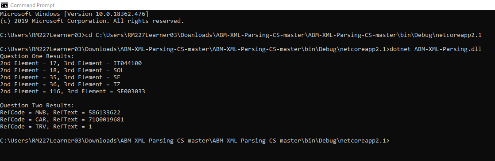

# ABM-XML-Parsing-CS
ABM Developer Technical Questions 1 &amp; 2 Using C#

# Requirements
* C#

# Deployment Instructions
* Download this repository as ZIP and extract the contents.
* Open Command Prompt and navigate to the ABM-XML-Parsing-CS-master\bin\Debug\netcoreapp2.1 directory.
* Use the "dotnet ABM-XML-Parsing.dll" command to run the program.

